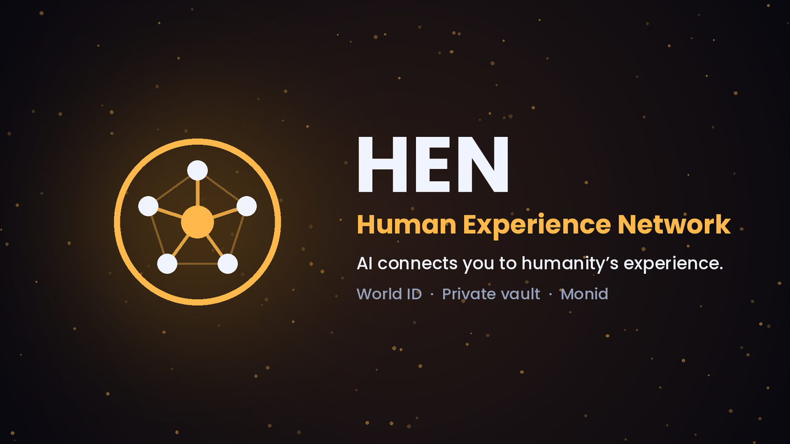
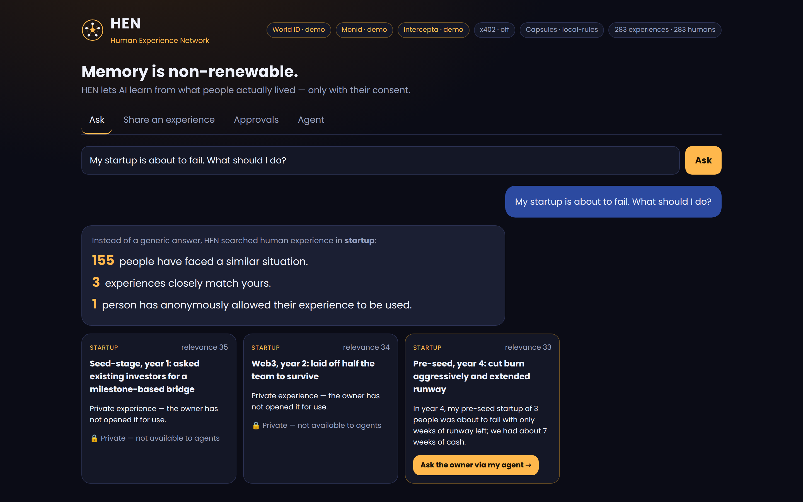
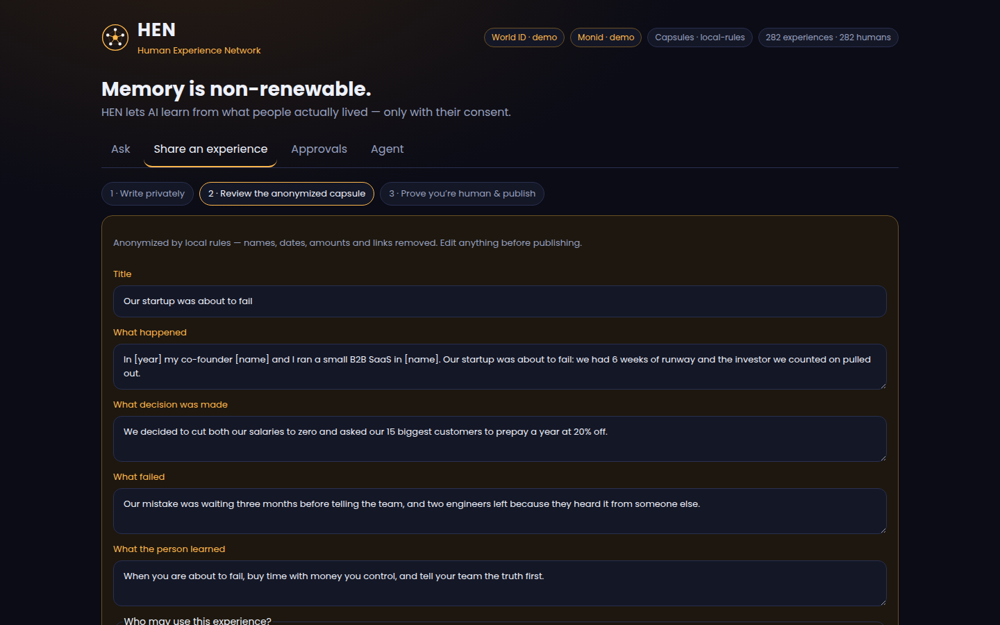
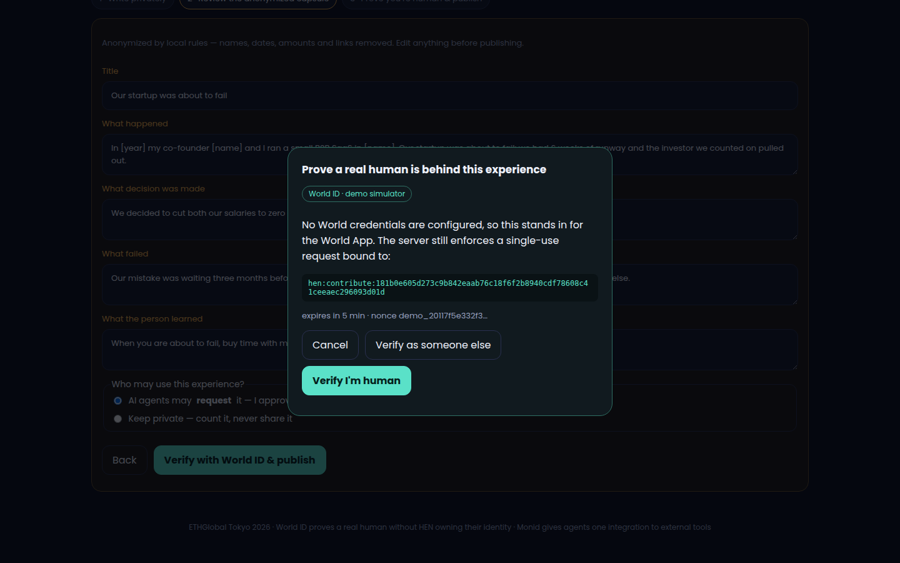
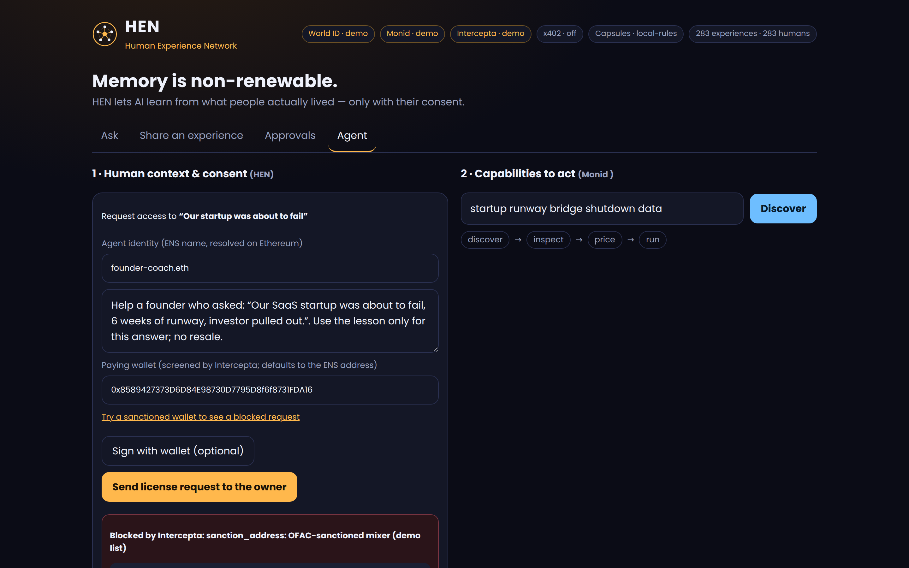
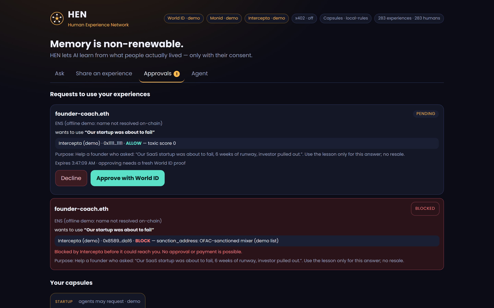
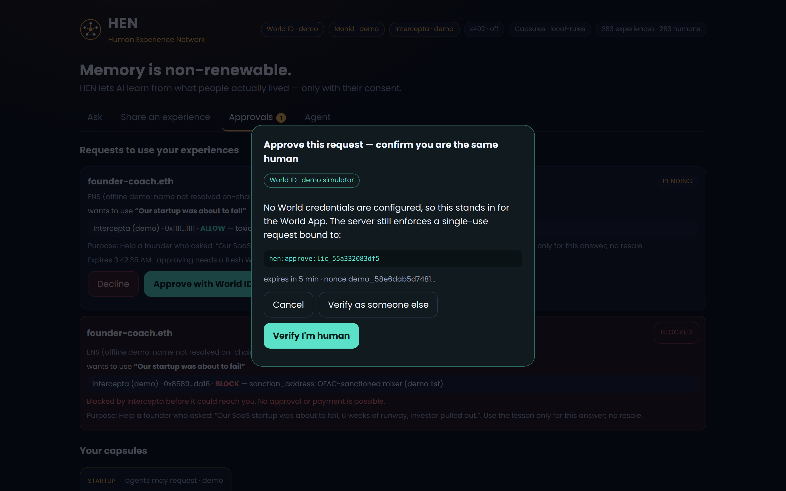
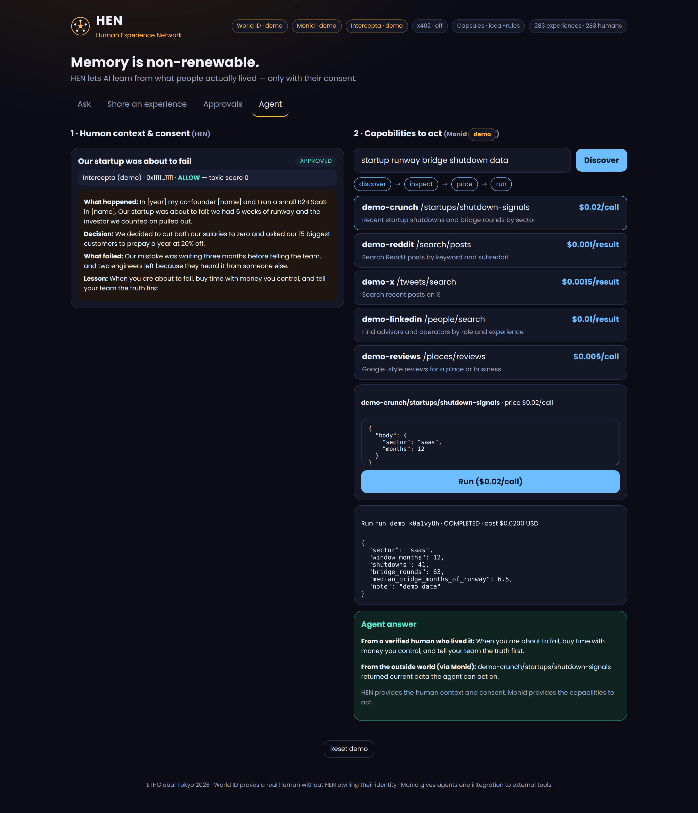
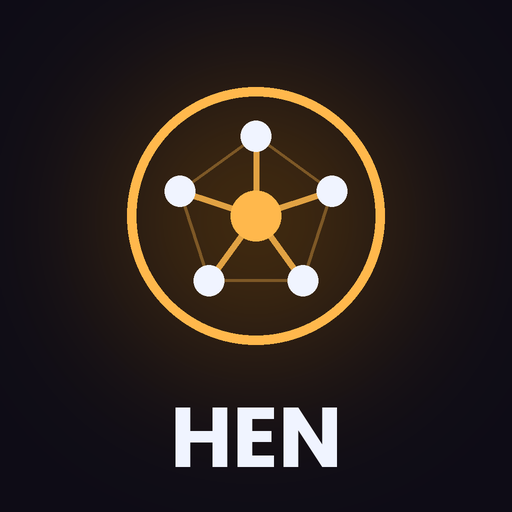

<p align="center"></p>

<h1 align="center">HEN — Human Experience Network</h1>

<p align="center"><b>Memory is non-renewable. AI connects you to humanity’s experience — only with human consent.</b><br>
ETHGlobal Tokyo 2026 · World ID · ENS · Intercepta · x402 · Monid</p>

<p align="center">
<a href="https://hen-experience-tokyo.vercel.app">▶ Live demo</a> ·
<a href="docs/HEN_pitch_demo_hq.mp4">🎬 Pitch video (3:46, HD)</a> ·
<a href="#-run-the-demo-in-one-minute">⚡ Run locally</a> ·
<a href="#-pitch-demo-script-2-minutes">🎤 Demo script</a> ·
<a href="#-sponsor-integrations-where-the-code-is">🧩 Sponsor code</a>
</p>

---

## The idea in 30 seconds

AI can generate infinite content. Humans can’t live infinite lives. A founder’s near-failure, a nurse’s thirty years of intuition, a first love: once gone, they can’t be recreated.

**HEN turns lived experience into anonymized *Experience Capsules*** (what happened · what was decided · what failed · what was learned). The original memory stays encrypted in the owner’s own vault. When you ask your AI *“My startup is about to fail — what should I do?”*, it answers with **how many real people faced this, which experiences match, and which owners let them be used.**

- **Humans stay in control.** Every capsule is backed by a real human (World ID). Every time an AI agent wants to use one, the owner gives **fresh World ID approval**, and can always decline.
- **Agents are accountable.** Agents identify with **ENS**, their wallets are screened by **Intercepta** before any money moves, and they pay per license with **x402**.
- **Agents can act.** **Monid** gives the agent one integration to discover, inspect, price and run external tools.

> **HEN provides the human context and consent. Monid provides the capabilities to act.**

---

## ⚡ Run the demo in one minute

Needs **Node.js 20.9+** (22 recommended). **No API keys needed.**

```bash
git clone https://github.com/RyoSAKu610/HEN-Human-experience-network-.git hen
cd hen
npm install
npm run demo          # builds, then serves http://localhost:3000
```

Open **http://localhost:3000**. Everything works end to end in **demo mode**.

| Command | Use it when |
|---|---|
| `npm run demo` | Normal pitch. ENS names resolve on Ethereum mainnet. If the Wi-Fi drops, the agent card says “ENS (offline demo)” instead of failing. |
| `npm run demo:offline` | **No internet at all.** Every flow still runs; ENS is shown as “offline demo”. |
| `npm run dev` | Development with hot reload. |
| `npm test` | End-to-end tests against a running server (`BASE=http://localhost:3000 npm test`). |

**Reset between rehearsals:** click **“Reset demo”** at the bottom of the page. It clears new capsules, requests and this browser’s demo identity.

The header chips show what is real right now: `World ID · demo/live`, `Monid · demo/live`, `Intercepta · demo/live`, `x402 · off/$0.01`.

---

## 🎤 Pitch demo script (≈2 minutes)

**Before you go on stage**
1. `npm run demo` (or open the live demo) → click **Reset demo**.
2. Browser full screen, zoom 110–125%, only this tab open.
3. Keep this README open on your phone for the lines to paste below.
4. Backup: if anything fails, play [`docs/HEN_pitch_demo_hq.mp4`](docs/HEN_pitch_demo_hq.mp4) (H.264, plays everywhere) or the smaller [`docs/HEN_pitch_demo.mp4`](docs/HEN_pitch_demo.mp4) (H.265, 28 MB).

| # | Click | Say | Judges see |
|---|---|---|---|
| 1 | **Ask** tab → paste line A → **Ask** | “Instead of another generic answer…” | *“154 people have faced a similar situation · 3 closely match · 2 allowed use.”* (Don’t click the agent button here: those capsules belong to other people.) |
| 2 | **Share an experience** → **Use a sample memory** → **Create Experience Capsule** | “My real memory never leaves my vault. AI turns it into an anonymized capsule.” | Names, years and amounts replaced by `[name]`, `[year]`; four fields. |
| 3 | **Verify with World ID & publish** → **Verify I’m human** | “World ID proves a real human is behind it, without HEN owning my identity.” | Proof bound to this exact capsule; published. |
| 4 | **Ask** → paste line B → **Ask** → **Ask the owner via my agent →** | “Now an AI agent wants to use my experience.” | Agent request form. |
| 5 | ENS name: `founder-coach.eth` → **Try a sanctioned wallet** → **Send** | “Agents are accountable: ENS identity, and Intercepta screens the wallet before any payment.” | 🔴 **Blocked by Intercepta: sanction_address.** Never reaches the owner. |
| 6 | Clear the wallet field → **Send license request** | “A clean agent gets through…” | Request **pending**. |
| 7 | **Approvals** → **Approve with World ID** → **Verify as someone else** | “…but only the human who lived it can approve.” | ❌ *“a different human owns this experience.”* |
| 8 | **Approve with World ID** → **Verify I’m human** | “Fresh human approval, right before the protected action. Declining is always one click.” | ✅ **Approved.** |
| 9 | **Agent** tab → **Discover** → click the first tool → **Run** | “HEN gives the human context. Monid gives the capabilities to act.” | Licensed lesson + Monid result → **Agent answer**. |

**Line A** `My startup is about to fail. What should I do?`
**Line B** `Our SaaS startup was about to fail, 6 weeks of runway, investor pulled out.`

---

## Screenshots

| Ask | Capsule review | World ID |
|---|---|---|
|  |  |  |
| **Intercepta blocks** | **Owner inbox** | **Fresh approval** |
|  |  |  |



---

## What’s real in demo mode (for judges)

| Piece | Demo mode (no keys) | Live mode (keys set) |
|---|---|---|
| **World ID** | A simulator dialog instead of World App. **The server checks are real:** single-use signed request, signal bound to the capsule / request, same-human (nullifier) check, replay rejection. | IDKit 4.3 + `developer.world.org/api/v4/verify` |
| **ENS** | Real mainnet resolution (`npm run demo`); offline stand-in only when there’s no internet, and it’s labelled. | Same |
| **Intercepta** | Local list of public OFAC-sanctioned addresses, labelled “(demo)”. The block / review / allow policy is the real one. | `api.web3antivirus.io` quick-scan with your key |
| **x402** | Off: approval unlocks directly. | USDC on Base Sepolia, settled only after Intercepta clears the payer again |
| **Monid** | Local catalog with the same response shapes, labelled `demo`. | `api.monid.ai` discover / inspect / run |
| **Capsule AI** | Local anonymization rules | Claude API |
| **Matching, vault encryption, licensing, tokens** | Real | Real |

The seed network (282 capsules) is synthetic, so the counts on the Ask tab include generated examples.

---

## 🧩 Sponsor integrations (where the code is)

| Sponsor | What HEN does with it | Code |
|---|---|---|
| **World ID** | Proof of personhood to publish; **fresh approval** (new signed request, user presence, same nullifier) before every license | [RP signing](lib/world.ts#L37) · [verify](lib/world.ts#L71-L90) · [widget](components/WorldVerify.tsx#L38) · [same-human check](app/api/licenses/%5Bid%5D/decide/route.ts#L22) · [decline path](app/api/licenses/%5Bid%5D/decide/route.ts#L17) |
| **ENS** | Agent identity: name → address, avatar, description; optional signature by the resolved address | [resolve](lib/ens.ts#L39) · [signature check](lib/ens.ts#L55) · [approval card](components/ApprovalsTab.tsx) |
| **Intercepta** | Screens the paying wallet when the request is made **and again right before settlement**; fails closed | [API call](lib/intercepta.ts#L51) · [policy](lib/intercepta.ts#L24-L35) · [at request](app/api/licenses/route.ts#L26) · [before settlement](app/api/licenses/%5Bid%5D/access/route.ts#L32) |
| **x402** | Paid license: `withX402`, settles only if the handler succeeds | [paid route](app/api/licenses/%5Bid%5D/access/route.ts#L43) · [agent pays](components/AgentTab.tsx) |
| **Monid** | Agent tools: discover → inspect → price → run | [client](lib/monid.ts#L37) · [UI](components/AgentTab.tsx) |

---

## Going live

Copy `.env.example` to `.env.local` (or set the same variables in Vercel) and fill in what you have. Each service switches to `live` on its own.

| Variable | Where to get it | Notes |
|---|---|---|
| `NEXT_PUBLIC_WLD_APP_ID`, `WLD_RP_ID`, `WLD_RP_SIGNING_KEY` | developer.world.org | Create the action **`hen-owner`** with **unlimited** verifications. The signing key stays server-side. |
| `NEXT_PUBLIC_WLD_ENV` | — | `staging` (test with simulator.worldcoin.org) or `production` |
| `INTERCEPTA_API_KEY` | Intercepta (free sandbox key for hackers) | Optional thresholds: `INTERCEPTA_BLOCK_SCORE` (70), `INTERCEPTA_REVIEW_SCORE` (40) |
| `X402_PAY_TO` | your receiving wallet | Turns on paid licenses. `X402_NETWORK=eip155:84532` (Base Sepolia), `X402_PRICE=$0.01` |
| `MONID_API_KEY` | app.monid.ai/access/api-keys | Runs cost real balance; the price shows before **Run** |
| `ENS_RPC_URL` | any mainnet RPC | Optional, for faster ENS lookups |
| `ANTHROPIC_API_KEY` | console.anthropic.com | Optional, better capsule extraction |

**Deploy:** import the repo in Vercel (framework: Next.js), add the variables, deploy. Storage is in memory plus a local JSON file, fine for a demo; use Postgres or KV for real persistence.

---

## Architecture

```
owner browser ── memory ──► AES-256-GCM (key never leaves the device) ──► /api/capsules  (ciphertext only)
      │               └───► /api/capsules/preview  (anonymize → capsule; plaintext not stored)
      └── World ID ◄── /api/world/context  (server-signed, single-use, bound to the capsule or request)

agent (ENS) ──► /api/licenses ──► Intercepta screen ──✗ blocked (never reaches the owner)
                                          └──✓ pending ──► owner: fresh World ID ──► approved
          ──► /api/licenses/:id/access  (x402: verify ► Intercepta again ► settle) ──► token ──► /api/capsules/:id
          ──► /api/monid  (discover · inspect · run)
```

`lib/world.ts` World ID · `lib/ens.ts` ENS · `lib/intercepta.ts` Intercepta · `lib/x402.ts` x402 · `lib/monid.ts` Monid · `lib/capsule.ts` anonymization · `lib/match.ts` matching · `lib/store.ts` storage.

---

## Judge FAQ

**Why World ID and not just a login?** HEN must know a real human stands behind each experience and each consent, but must never own that person’s identity. HEN stores only an RP-scoped nullifier.

**What does “fresh approval” mean exactly?** Every approval needs a new request signed by our server, valid 5 minutes, usable once, bound to that request’s id, with user presence, from the same human who published the capsule. A replayed proof, a proof for another request, or a different person are all rejected (covered by `npm test`).

**Can the agent read the original memory?** No. The server only has ciphertext. A license token opens one anonymized capsule, never the vault.

**What stops a scam agent?** It must present an ENS identity, and Intercepta screens its paying wallet before the owner ever sees the request, and again before any USDC settles. If screening fails, HEN blocks.

---

## Intercepta API feedback
- The `quick-scan` response (`toxicScore` + `traits[]`) was easy to map to allow / review / block. A published list of every trait name with its severity would make policies safer than hard-coding names.
- The path lives under `/api/public/v2/extension/...`. “Extension” suggests the browser extension; a documented `/v2/account/...` alias would be clearer for server-side payment flows.
- Please document whether `toxicScore` is 0–100 on every endpoint (quick vs deep scan), plus recommended block / review thresholds for payments.
- An official x402 example (screen `authorization.from` before settlement) would save every team the same glue code.

## Known limits
- Live World ID, Intercepta, x402 settlement and Monid were written against the official SDKs and APIs, but the build machine’s network blocked those hosts, so run a staging check with your keys before relying on live mode.
- Local anonymization is rule-based. The UI always makes the owner review a capsule before publishing.

<p align="center"><br>Built at ETHGlobal Tokyo 2026</p>
